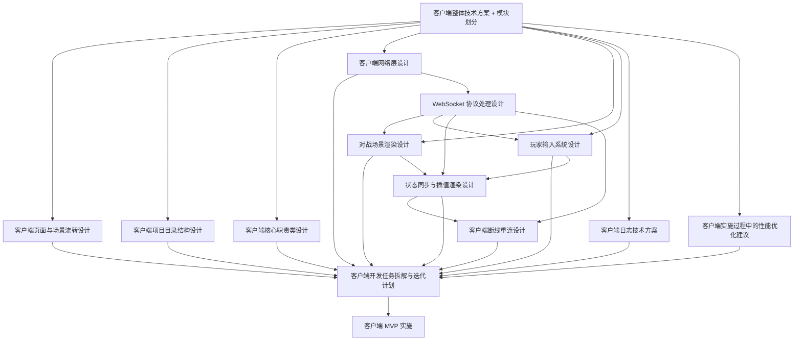

下面把前面已经整理过的 **客户端文档名称、实施依赖关系、主要功能** 汇总成一张总图。可以把它理解为客户端从“方案设计”到“落地实施”的文档依赖地图。

# 1. 客户端文档依赖关系图



------

# 2. 按实施顺序看的依赖关系

如果真正落地开发，推荐按下面顺序理解：

```text
1. 客户端整体技术方案 + 模块划分
   ↓
2. 客户端页面与场景流转设计
   ↓
3. 客户端项目目录结构设计
   ↓
4. 客户端核心职责类设计
   ↓
5. 客户端网络层设计
   ↓
6. WebSocket 协议处理设计
   ↓
7. 对战场景渲染设计
   ↓
8. 玩家输入系统设计
   ↓
9. 状态同步与插值渲染设计
   ↓
10. 客户端断线重连设计
   ↓
11. 客户端日志技术方案
   ↓
12. 客户端实施过程中的性能优化建议
   ↓
13. 客户端开发任务拆解与迭代计划
   ↓
14. 客户端 MVP 实施
```

不过实际开发时，**日志方案和性能优化建议不是最后才做**，而是从第一版代码开始就要贯穿执行。

------

# 3. 文档功能汇总表

| 序号 | 文档名称                       | 主要功能                                                     | 依赖关系                      |
| ---- | ------------------------------ | ------------------------------------------------------------ | ----------------------------- |
| 1    | 客户端整体技术方案 + 模块划分  | 定义客户端总体架构、技术栈、核心模块、MVP 范围               | 所有客户端文档的总纲          |
| 2    | 客户端页面与场景流转设计       | 定义 Boot、Login、Lobby、Match、Game、Settlement 等页面和跳转关系 | 依赖整体技术方案              |
| 3    | 客户端网络层设计               | 定义 HTTP、WebSocket、心跳、重连、网络状态、错误处理         | 依赖整体技术方案              |
| 4    | WebSocket 协议处理设计         | 定义 ENTER_ROOM、READY、MOVE、ROOM_SNAPSHOT、RANK_UPDATE、SETTLEMENT_RESULT 等消息协议 | 依赖网络层设计                |
| 5    | 对战场景渲染设计               | 定义 GameScene、地图层、玩家球体、食物、HUD、相机、对象池    | 依赖整体方案和 WebSocket 协议 |
| 6    | 玩家输入系统设计               | 定义虚拟摇杆、MOVE 发送、分裂、吐球、输入状态机、输入限频    | 依赖 WebSocket 协议和对战场景 |
| 7    | 状态同步与插值渲染设计         | 定义 ROOM_SNAPSHOT 处理、BattleState、EntityManager、插值、快照乱序处理 | 依赖协议、渲染、输入          |
| 8    | 客户端断线重连设计             | 定义 WebSocket 断开、心跳超时、RECONNECT、恢复快照、结算找回 | 依赖网络层、协议、状态同步    |
| 9    | 客户端项目目录结构设计         | 定义 Cocos 工程目录、scripts、scenes、prefabs、textures、configs 等结构 | 依赖整体模块划分              |
| 10   | 客户端核心职责类设计           | 定义 AppContext、SceneRouter、HttpClient、WsClient、BattleManager、EntityManager、InputManager 等核心类职责 | 依赖目录结构和整体模块设计    |
| 11   | 客户端实施过程中的性能优化建议 | 定义对象池、视野裁剪、快照包体、节点数量、文本刷新、JSON 解析等优化约束 | 贯穿所有开发阶段              |
| 12   | 客户端开发任务拆解与迭代计划   | 把所有客户端设计拆成阶段任务、开发顺序、验收标准             | 依赖所有前置设计文档          |
| 13   | 客户端日志技术方案             | 定义客户端日志事件、日志级别、性能日志、网络日志、快照日志、后续上报方案 | 贯穿所有模块                  |

------

# 4. 各文档主要功能总结

## 4.1 客户端整体技术方案 + 模块划分

这是客户端的总纲文档。

主要确定：

```text
客户端用什么技术栈
客户端有哪些模块
哪些模块属于 MVP
哪些模块后续再做
HTTP 和 WebSocket 如何分工
页面、网络、协议、渲染、输入、状态如何分层
```

它解决的是：

```text
客户端整体怎么设计
客户端由哪些部分组成
第一版先做什么，不做什么
```

------

## 4.2 客户端页面与场景流转设计

这个文档负责定义玩家看到的页面和页面之间的跳转关系。

核心页面包括：

```text
BootScene
LoginScene
LobbyScene
MatchScene
GameScene
SettlementScene
```

它解决的是：

```text
玩家从打开游戏到完成一局，客户端页面如何流转
每个页面负责什么
页面失败时怎么兜底
```

------

## 4.3 客户端网络层设计

这个文档定义客户端和服务端通信的基础设施。

主要内容：

```text
HttpClient
ApiService
WsClient
WsMessageDispatcher
HeartbeatClient
ReconnectClient
NetworkState
NetworkErrorHandler
```

它解决的是：

```text
普通接口怎么请求
实时对战怎么连接
WebSocket 怎么管理
心跳和重连怎么做
网络错误怎么统一处理
```

------

## 4.4 WebSocket 协议处理设计

这个文档细化实时对战协议。

主要消息包括：

```text
ENTER_ROOM
ENTER_ROOM_RESULT
READY
GAME_START
MOVE
SPLIT
EJECT
ROOM_SNAPSHOT
RANK_UPDATE
GAME_END
SETTLEMENT_RESULT
PING
PONG
RECONNECT
ROOM_RECOVER_SNAPSHOT
ERROR
```

它解决的是：

```text
客户端和 Game Server 通过 WebSocket 传什么
消息结构是什么
哪些消息客户端发
哪些消息服务端发
错误如何返回
重连如何恢复
```

------

## 4.5 对战场景渲染设计

这个文档负责 GameScene 的画面表现。

主要内容：

```text
地图背景
地图边界
玩家球体
食物
吐出物
刺球预留
HUD
排行榜
相机跟随
对象池
可见性裁剪
```

它解决的是：

```text
服务端发来的状态如何展示成游戏画面
玩家球体和食物如何渲染
怎样避免浏览器节点过多导致卡顿
```

------

## 4.6 玩家输入系统设计

这个文档负责玩家操作。

主要内容：

```text
虚拟摇杆
MOVE 发送
分裂按钮
吐球按钮
输入状态机
输入限频
死亡后禁用输入
断线后禁用输入
GAME_END 后停止输入
```

它解决的是：

```text
玩家如何控制球体
客户端多久发一次 MOVE
哪些状态下允许输入
如何避免输入消息过于频繁
```

------

## 4.7 状态同步与插值渲染设计

这个文档负责客户端如何接收服务端状态，并平滑展示。

主要内容：

```text
ROOM_SNAPSHOT 接收
BattleState 更新
StateReconciler 差异计算
EntityManager 创建/更新/删除实体
display 和 target 分离
目标插值
旧快照丢弃
快照乱序处理
```

它解决的是：

```text
服务端每 100ms 发一次快照
客户端每帧如何平滑显示
快照延迟、乱序、丢失时如何处理
```

------

## 4.8 客户端断线重连设计

这个文档负责 H5 真实环境中的网络异常恢复。

主要内容：

```text
WebSocket close
心跳超时
页面切后台
页面恢复
RECONNECT
RECONNECT_RESULT
ROOM_RECOVER_SNAPSHOT
重连遮罩
结算找回
```

它解决的是：

```text
玩家网络断了怎么办
短断线如何恢复
长断线如何退出
房间已结束时如何找回结算
```

------

## 4.9 客户端项目目录结构设计

这个文档负责代码工程组织。

主要目录包括：

```text
assets/scenes
assets/scripts/app
assets/scripts/common
assets/scripts/network
assets/scripts/protocol
assets/scripts/modules
assets/scripts/battle
assets/scripts/entity
assets/scripts/ui
assets/scripts/scene
assets/prefabs
assets/textures
assets/configs
```

它解决的是：

```text
代码文件怎么放
不同模块怎么分目录
避免所有代码堆在一起
后续扩展时不混乱
```

------

## 4.10 客户端核心职责类设计

这个文档把设计落到类级别。

核心类包括：

```text
App
AppContext
AppState
SceneRouter
HttpClient
ApiService
WsClient
WsMessageDispatcher
BattleManager
BattleState
SnapshotReceiver
EntityManager
RenderSystem
InputManager
UIManager
PlayerBallView
FoodView
SettlementManager
```

它解决的是：

```text
每个类负责什么
类之间怎么依赖
哪些逻辑不能放错地方
如何避免 BattleManager、UI、网络层职责混乱
```

------

## 4.11 客户端实施过程中的性能优化建议

这个文档定义实施过程中的性能红线。

重点包括：

```text
只渲染视野内对象
食物和球体必须对象池化
控制节点数量
控制 Label 数量
控制快照包体
MOVE 不每帧发送
排行榜不高频刷新
快照处理不能做重逻辑
生产环境关闭高频日志
移动端真机持续测试
```

它解决的是：

```text
H5 浏览器性能容易成为瓶颈
实施过程中如何避免前端卡顿
哪些优化必须从第一版开始做
```

------

## 4.12 客户端开发任务拆解与迭代计划

这个文档负责把前面的方案变成实施计划。

阶段包括：

```text
阶段 0：准备阶段
阶段 1：项目骨架与基础设施
阶段 2：页面与场景闭环
阶段 3：HTTP 接入与登录匹配
阶段 4：WebSocket 接入与入房
阶段 5：对战场景渲染
阶段 6：输入与状态同步
阶段 7：排行榜与结算闭环
阶段 8：性能优化与稳定性
```

它解决的是：

```text
先开发什么
后开发什么
每个阶段产出什么
每个阶段如何验收
```

------

## 4.13 客户端日志技术方案

这个文档负责客户端问题定位和性能观测。

主要日志包括：

```text
启动日志
场景日志
登录日志
HTTP 日志
匹配日志
WebSocket 日志
入房日志
输入日志
快照日志
渲染性能日志
心跳和重连日志
结算日志
H5 页面状态日志
```

它解决的是：

```text
客户端出问题时怎么定位
哪个玩家、哪个房间、哪个快照出问题
卡顿、断线、结算丢失如何排查
日志如何避免影响性能
```

------

# 5. 从实施角度看的文档分层

可以把这些文档分成 5 层。

```text
第一层：总体设计
  - 客户端整体技术方案 + 模块划分

第二层：业务流程设计
  - 客户端页面与场景流转设计
  - 客户端开发任务拆解与迭代计划

第三层：技术基础设计
  - 客户端项目目录结构设计
  - 客户端核心职责类设计
  - 客户端网络层设计
  - WebSocket 协议处理设计

第四层：对战核心设计
  - 对战场景渲染设计
  - 玩家输入系统设计
  - 状态同步与插值渲染设计
  - 客户端断线重连设计

第五层：工程保障设计
  - 客户端日志技术方案
  - 客户端实施过程中的性能优化建议
```

------

# 6. 最终总结

整个客户端文档体系可以概括成一条实施主线：

```text
先确定整体模块
再确定页面流程
再确定目录和核心类
再确定网络和协议
再确定对战渲染、输入和同步
再补齐断线重连
再用日志和性能方案保障可排查、可优化
最后通过开发任务拆解落地 MVP
```

最核心的依赖关系是：

```text
整体技术方案
  ↓
页面流程 / 目录结构 / 核心类
  ↓
网络层 / WebSocket 协议
  ↓
对战渲染 / 输入系统 / 状态同步
  ↓
断线重连 / 日志 / 性能优化
  ↓
开发任务拆解
  ↓
客户端 MVP 实施
```

客户端 MVP 最终要实现的能力就是：

```text
玩家打开 H5 页面
  ↓
游客登录
  ↓
进入大厅
  ↓
开始匹配
  ↓
进入 GameScene
  ↓
WebSocket 入房
  ↓
摇杆移动
  ↓
服务端快照同步
  ↓
渲染玩家和食物
  ↓
展示排行榜
  ↓
收到结算
  ↓
返回大厅或再来一局
```