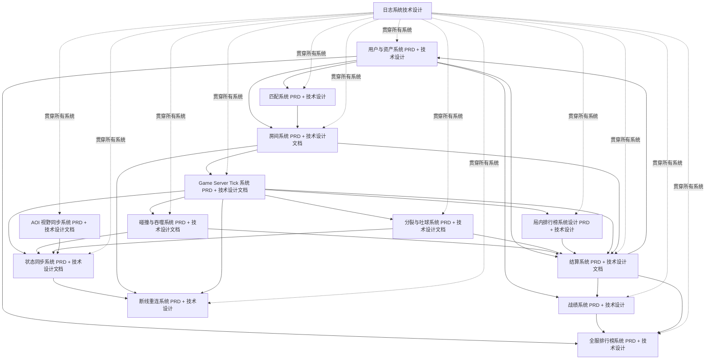
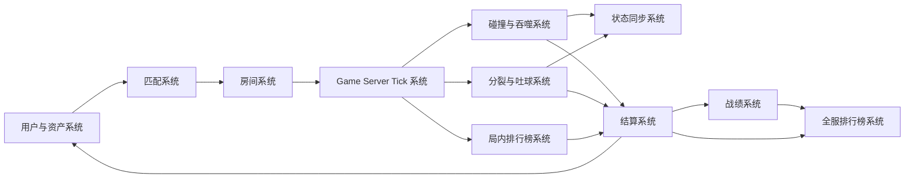
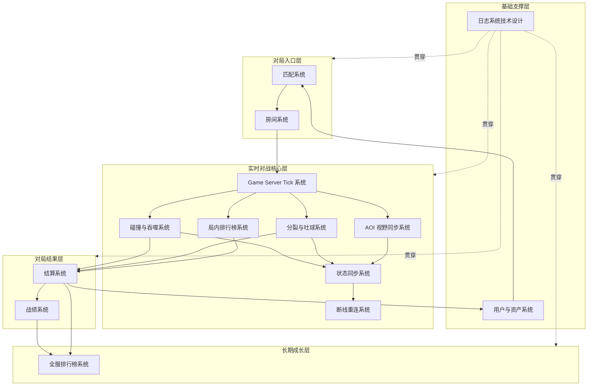

# 1. 服务端文档实施依赖总图



------

# 2. 按服务端实施顺序看

从真正开发落地角度，推荐顺序是：

```text
1. 日志系统技术设计
   ↓
2. 用户与资产系统 PRD + 技术设计
   ↓
3. 匹配系统 PRD + 技术设计
   ↓
4. 房间系统 PRD + 技术设计文档
   ↓
5. Game Server Tick 系统 PRD + 技术设计文档
   ↓
6. 碰撞与吞噬系统 PRD + 技术设计文档
   ↓
7. 分裂与吐球系统 PRD + 技术设计文档
   ↓
8. AOI 视野同步系统 PRD + 技术设计文档
   ↓
9. 状态同步系统 PRD + 技术设计文档
   ↓
10. 局内排行榜系统设计 PRD + 技术设计
   ↓
11. 断线重连系统 PRD + 技术设计
   ↓
12. 结算系统 PRD + 技术设计文档
   ↓
13. 战绩系统 PRD + 技术设计
   ↓
14. 全服排行榜系统 PRD + 技术设计
```

这里有个重点：**日志系统虽然排在第 1 个，但不是业务主链路的一环，而是工程基础能力**。它应该从第一天就接入，后续每个模块都打日志。

------

# 3. 服务端核心链路依赖图

如果只看一局游戏的主流程，可以简化成下面这样：



对应业务流程是：

```text
用户登录 / 游客身份
  ↓
进入匹配
  ↓
创建或加入房间
  ↓
Game Server Tick 驱动一局游戏
  ↓
处理移动、碰撞、吞噬、分裂、吐球
  ↓
状态同步给客户端
  ↓
局内排行榜实时更新
  ↓
对局结束后生成结算
  ↓
写入战绩
  ↓
更新资产和全服排行榜
```

------

# 4. 各文档主要功能总结

## 4.1 用户与资产系统 PRD + 技术设计

这是服务端的基础用户体系。

主要负责：

```text
游客用户创建
用户基础信息
金币 / 经验 / 等级 / 资产
结算奖励入账
用户资产查询
```

它依赖最少，但很多模块都依赖它。

被依赖方包括：

```text
匹配系统
结算系统
战绩系统
全服排行榜系统
客户端大厅展示
```

------

## 4.2 匹配系统 PRD + 技术设计

匹配系统负责把玩家放进合适的对局。

主要负责：

```text
开始匹配
取消匹配
匹配池管理
匹配状态查询
匹配成功后分配 roomId
返回 wsUrl / enterToken
```

它依赖：

```text
用户与资产系统
```

它输出给：

```text
房间系统
客户端 GameScene
```

------

## 4.3 房间系统 PRD + 技术设计文档

房间系统负责承载一局游戏的玩家集合和房间生命周期。

主要负责：

```text
创建房间
玩家进入房间
玩家准备
房间状态流转
房间玩家列表
房间开始条件
房间结束条件
```

它依赖：

```text
匹配系统
用户与资产系统
```

它支撑：

```text
Game Server Tick
状态同步
断线重连
结算系统
```

------

## 4.4 Game Server Tick 系统 PRD + 技术设计文档

这是实时对战服务端的核心。

主要负责：

```text
固定 Tick 推进
读取玩家输入
更新玩家位置
推进技能状态
触发碰撞检测
生成房间快照
判断游戏是否结束
```

它依赖：

```text
房间系统
```

它支撑：

```text
碰撞与吞噬
分裂与吐球
状态同步
局内排行榜
结算系统
```

这个文档是服务端实时战斗的核心文档。

------

## 4.5 碰撞与吞噬系统 PRD + 技术设计文档

碰撞与吞噬系统负责判断玩家之间、玩家和食物之间的交互。

主要负责：

```text
玩家吃食物
大球吞小球
质量增长
死亡判定
碰撞检测优化
吞噬事件生成
```

它依赖：

```text
Game Server Tick
房间状态
玩家球体状态
```

它影响：

```text
状态同步
局内排行榜
结算系统
战绩系统
```

------

## 4.6 分裂与吐球系统 PRD + 技术设计文档

分裂与吐球系统负责玩家主动技能。

主要负责：

```text
分裂请求处理
分裂冷却
质量门槛校验
分裂球体生成
吐球请求处理
吐球冷却
吐出物生成
技能失败原因返回
```

它依赖：

```text
Game Server Tick
玩家质量
玩家输入
房间状态
```

它影响：

```text
状态同步
碰撞与吞噬
结算系统
局内排行榜
```

------

## 4.7 AOI 视野同步系统 PRD + 技术设计文档

AOI 系统负责减少每个客户端收到的数据量。

主要负责：

```text
按玩家视野筛选对象
只同步附近玩家
只同步附近食物
降低快照包体
降低浏览器渲染压力
降低 WebSocket 广播压力
```

它依赖：

```text
房间地图
玩家位置
食物位置
空间索引
Game Server Tick
```

它服务于：

```text
状态同步系统
客户端渲染性能优化
```

注意：MVP 可以先全量同步，小规模验证；但如果目标是百人房间，AOI 后续很关键。

------

## 4.8 状态同步系统 PRD + 技术设计文档

状态同步系统负责把服务端权威状态发送给客户端。

主要负责：

```text
ROOM_SNAPSHOT
ROOM_DELTA，后续
玩家位置同步
食物同步
吐出物同步
玩家死亡同步
事件同步
快照频率控制
快照序号管理
```

它依赖：

```text
Game Server Tick
AOI 视野同步
碰撞与吞噬
分裂与吐球
房间系统
```

它输出给：

```text
客户端状态同步与插值渲染
客户端对战场景渲染
断线重连恢复
```

------

## 4.9 局内排行榜系统设计 PRD + 技术设计

局内排行榜负责一局游戏中的实时排名。

主要负责：

```text
根据质量 / 分数计算排名
Top N 排名
个人当前排名
RANK_UPDATE 推送
排行榜刷新频率控制
```

它依赖：

```text
Game Server Tick
玩家质量变化
碰撞与吞噬结果
```

它影响：

```text
客户端 RankPanel
结算排名
战绩数据
```

------

## 4.10 断线重连系统 PRD + 技术设计

断线重连系统负责玩家短时间断线后的恢复。

主要负责：

```text
玩家连接断开检测
重连窗口
reconnectToken 校验
玩家状态保留
RECONNECT_RESULT
ROOM_RECOVER_SNAPSHOT
重连失败兜底
```

它依赖：

```text
房间系统
Game Server Tick
状态同步系统
用户身份
WebSocket 连接管理
```

它影响：

```text
客户端断线重连
状态恢复
结算找回
用户体验
```

------

## 4.11 结算系统 PRD + 技术设计文档

结算系统负责一局游戏结束后的结果生成。

主要负责：

```text
最终排名
最终得分
最大质量
吞噬玩家数
吞噬食物数
存活时间
金币奖励
经验奖励
资产入账
结算结果推送
```

它依赖：

```text
房间系统
Game Server Tick
碰撞与吞噬系统
分裂与吐球系统
局内排行榜系统
用户与资产系统
```

它输出给：

```text
战绩系统
全服排行榜系统
用户资产系统
客户端结算页
```

------

## 4.12 战绩系统 PRD + 技术设计

战绩系统负责保存用户历史对局记录。

主要负责：

```text
保存每局战绩
查询历史战绩
查询战绩详情
展示排名、得分、奖励、时间
```

它依赖：

```text
结算系统
用户系统
房间系统
```

它服务于：

```text
客户端战绩页
用户个人数据展示
全服排行榜数据参考
```

------

## 4.13 全服排行榜系统 PRD + 技术设计

全服排行榜负责跨房间、跨对局的长期排行。

主要负责：

```text
总分排行榜
最高质量排行榜
胜场 / 排名榜
日榜 / 周榜 / 总榜
个人排名查询
排行榜缓存
```

它依赖：

```text
结算系统
战绩系统
用户与资产系统
```

它服务于：

```text
客户端排行榜页
用户长期目标
运营活动，后续
```

------

## 4.14 日志系统技术设计

日志系统是所有服务端模块的基础支撑。

主要负责：

```text
结构化日志
traceId
userId
roomId
matchId
workflow / battle 链路追踪
接口耗时
Tick 耗时
快照耗时
碰撞耗时
结算耗时
错误日志
性能日志
```

它不只是独立模块，而是贯穿所有模块。

应该覆盖：

```text
匹配日志
房间日志
Tick 日志
输入日志
碰撞日志
状态同步日志
重连日志
结算日志
资产变更日志
排行榜日志
```

------

# 5. 实施分层图

可以把这些服务端文档分成 5 层。



------

# 6. 实施优先级建议

## P0：必须优先完成

```text
日志系统技术设计
用户与资产系统
匹配系统
房间系统
Game Server Tick 系统
状态同步系统
碰撞与吞噬系统
结算系统
```

原因：

这几个模块能支撑最小闭环：

```text
用户进入游戏
  ↓
匹配进房间
  ↓
服务端 Tick 推动游戏
  ↓
移动和吞噬
  ↓
状态同步给客户端
  ↓
游戏结束
  ↓
生成结算
```

------

## P1：主链路增强

```text
局内排行榜系统
断线重连系统
战绩系统
分裂与吐球系统
AOI 视野同步系统
```

原因：

这些模块会明显提升可玩性、稳定性和性能。

其中 AOI 对百人房间很重要，但 MVP 小规模验证时可以先弱化。

------

## P2：长期成长和规模化

```text
全服排行榜系统
更完整的 AOI 优化
更完整的重连恢复
更完整的日志监控和指标体系
```

原因：

这些属于长期体验、留存和规模化能力。

------

# 7. 最终总结

从你截图里可见的服务端文档来看，整体依赖主线是：

```text
用户与资产系统
  ↓
匹配系统
  ↓
房间系统
  ↓
Game Server Tick 系统
  ↓
碰撞与吞噬 / 分裂与吐球
  ↓
AOI / 状态同步
  ↓
局内排行榜
  ↓
结算系统
  ↓
战绩系统
  ↓
全服排行榜系统
```

横向保障能力是：

```text
日志系统技术设计
```

它要贯穿所有服务端模块。

服务端最小 MVP 闭环可以先抓这条线：

```text
用户
  ↓
匹配
  ↓
房间
  ↓
Tick
  ↓
移动 / 碰撞 / 吞噬
  ↓
状态同步
  ↓
结算
```

然后再逐步补：

```text
分裂吐球
局内排行榜
断线重连
战绩
全服排行榜
AOI 优化
```

这样实施风险最低，也最容易和客户端联调。